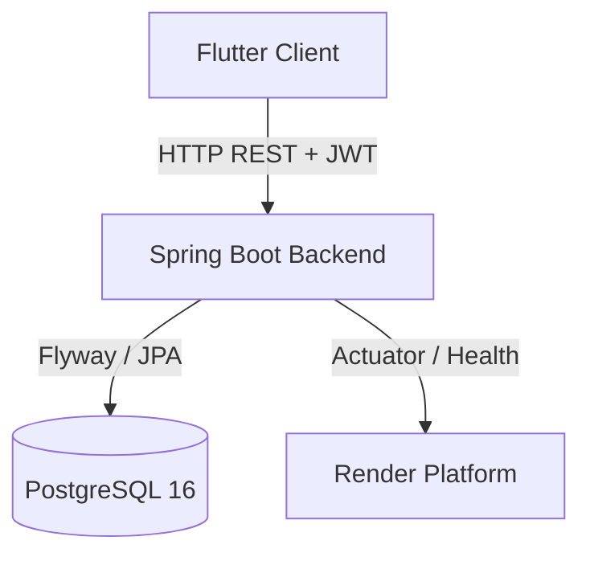

# Implementation Plan - Expense-Splitting App

This document outlines the detailed architecture, database design, API design, core logic (settlement engine), and frontend implementation plan for the group expense-splitting web application.

---

## User Review Required

Please review the proposed design and confirm:
1. **Primary Key Strategy**: We will use `BIGINT` with `BIGSERIAL` for auto-incrementing integer primary keys across all tables for simplicity and human-readability. If UUIDs are preferred, let us know.
2. **Idempotency Store**: We will store idempotency records in a dedicated database table `idempotency_records`. This ensures idempotency keys are persistent across server restarts and clustered instances.
3. **Flutter State Management**: We will use a clean, vanilla Flutter provider pattern for state management, which is lightweight and robust.

---

## Technical Architecture Overview

The system consists of:
1. **Backend**: Spring Boot 3.x (Java 21), Spring Web, Spring Data JPA, Spring Security (JWT-based, stateless), Flyway migrations.
2. **Database**: PostgreSQL 16.
3. **Frontend**: Flutter consuming the stateless REST API.
4. **Local Dev Containerization**: Docker Compose running the backend API and Postgres.
5. **Deployment Target**: Render.



---

## Proposed Changes

### Component 1: Database Schema (Flyway Migrations)

We will use Flyway for database migration. We'll create `V1__Initial_Schema.sql` inside the resources folder.

#### [NEW] [V1__Initial_Schema.sql](file:///c:/Users/kumar/OneDrive/Desktop/split/backend/src/main/resources/db/migration/V1__Initial_Schema.sql)

```sql
-- Users table
CREATE TABLE users (
    id BIGSERIAL PRIMARY KEY,
    email VARCHAR(255) NOT NULL UNIQUE,
    password_hash VARCHAR(255) NOT NULL,
    created_at TIMESTAMP NOT NULL DEFAULT CURRENT_TIMESTAMP
);

-- Groups table
CREATE TABLE groups (
    id BIGSERIAL PRIMARY KEY,
    name VARCHAR(255) NOT NULL,
    currency VARCHAR(10) NOT NULL,
    created_at TIMESTAMP NOT NULL DEFAULT CURRENT_TIMESTAMP
);

-- Group Invite Codes table
CREATE TABLE group_invite_codes (
    id BIGSERIAL PRIMARY KEY,
    group_id BIGINT NOT NULL REFERENCES groups(id) ON DELETE CASCADE,
    code VARCHAR(10) NOT NULL UNIQUE,
    expires_at TIMESTAMP,
    max_uses INT,
    uses_count INT NOT NULL DEFAULT 0,
    created_at TIMESTAMP NOT NULL DEFAULT CURRENT_TIMESTAMP
);

-- Group Members table (Many-to-Many join table)
CREATE TABLE group_members (
    group_id BIGINT NOT NULL REFERENCES groups(id) ON DELETE CASCADE,
    user_id BIGINT NOT NULL REFERENCES users(id) ON DELETE CASCADE,
    PRIMARY KEY (group_id, user_id)
);

-- Expenses table (Optimistic locking version field included)
CREATE TABLE expenses (
    id BIGSERIAL PRIMARY KEY,
    group_id BIGINT NOT NULL REFERENCES groups(id) ON DELETE CASCADE,
    payer_id BIGINT NOT NULL REFERENCES users(id),
    amount NUMERIC(19, 4) NOT NULL,
    description VARCHAR(255) NOT NULL,
    split_type VARCHAR(20) NOT NULL, -- EQUAL, EXACT, PERCENTAGE, SHARES
    category VARCHAR(50) NOT NULL DEFAULT 'General',
    expense_date TIMESTAMP NOT NULL DEFAULT CURRENT_TIMESTAMP,
    is_deleted BOOLEAN NOT NULL DEFAULT FALSE,
    version BIGINT NOT NULL DEFAULT 0,
    created_at TIMESTAMP NOT NULL DEFAULT CURRENT_TIMESTAMP
);

-- Expense Shares table
CREATE TABLE expense_shares (
    id BIGSERIAL PRIMARY KEY,
    expense_id BIGINT NOT NULL REFERENCES expenses(id) ON DELETE CASCADE,
    user_id BIGINT NOT NULL REFERENCES users(id) ON DELETE CASCADE,
    share_amount NUMERIC(19, 4) NOT NULL,
    percentage NUMERIC(5, 2),
    shares NUMERIC(10, 2)
);

-- Settlements table
CREATE TABLE settlements (
    id BIGSERIAL PRIMARY KEY,
    group_id BIGINT NOT NULL REFERENCES groups(id) ON DELETE CASCADE,
    paid_by_id BIGINT NOT NULL REFERENCES users(id) ON DELETE CASCADE,
    paid_to_id BIGINT NOT NULL REFERENCES users(id) ON DELETE CASCADE,
    amount NUMERIC(19, 4) NOT NULL,
    note VARCHAR(255),
    settlement_date TIMESTAMP NOT NULL DEFAULT CURRENT_TIMESTAMP,
    version BIGINT NOT NULL DEFAULT 0,
    created_at TIMESTAMP NOT NULL DEFAULT CURRENT_TIMESTAMP
);

-- Idempotency Records table
CREATE TABLE idempotency_records (
    key_value VARCHAR(255) PRIMARY KEY,
    response_body TEXT NOT NULL,
    status_code INT NOT NULL,
    created_at TIMESTAMP NOT NULL DEFAULT CURRENT_TIMESTAMP
);
```

---

### Component 2: Backend Backend (Spring Boot Project Structure)

We will set up a standard Spring Boot application under `backend/`.

#### [NEW] [pom.xml](file:///c:/Users/kumar/OneDrive/Desktop/split/backend/pom.xml)
- Configured with Spring Boot 3.3.x parent, Java 21, and dependencies: Web, Data JPA, Security, Postgres Driver, Flyway Core, Flyway Database Postgres, Actuator, Validation, and JWT (`jjwt-api`, `jjwt-impl`, `jjwt-jackson`).

#### [NEW] [application.properties](file:///c:/Users/kumar/OneDrive/Desktop/split/backend/src/main/resources/application.properties)
- Database credentials configured from environment variables.
- JWT secret configuration.
- Flyway migration enabled. Actuator endpoints exposed.

#### [NEW] Security & JWT
- [SecurityConfig.java](file:///c:/Users/kumar/OneDrive/Desktop/split/backend/src/main/java/com/split/expensesplit/config/SecurityConfig.java): Statless session management, BCryptPasswordEncoder (strength 12), security filters.
- [JwtFilter.java](file:///c:/Users/kumar/OneDrive/Desktop/split/backend/src/main/java/com/split/expensesplit/config/JwtFilter.java): JWT validation from Authorization headers.
- [JwtService.java](file:///c:/Users/kumar/OneDrive/Desktop/split/backend/src/main/java/com/split/expensesplit/config/JwtService.java): Generation and parsing of short-lived access tokens and refresh tokens.

#### [NEW] Core Domain Entities (JPA)
- [User.java](file:///c:/Users/kumar/OneDrive/Desktop/split/backend/src/main/java/com/split/expensesplit/entity/User.java)
- [Group.java](file:///c:/Users/kumar/OneDrive/Desktop/split/backend/src/main/java/com/split/expensesplit/entity/Group.java)
- [GroupInviteCode.java](file:///c:/Users/kumar/OneDrive/Desktop/split/backend/src/main/java/com/split/expensesplit/entity/GroupInviteCode.java)
- [Expense.java](file:///c:/Users/kumar/OneDrive/Desktop/split/backend/src/main/java/com/split/expensesplit/entity/Expense.java) (with `@Version` tag on version field)
- [ExpenseShare.java](file:///c:/Users/kumar/OneDrive/Desktop/split/backend/src/main/java/com/split/expensesplit/entity/ExpenseShare.java)
- [Settlement.java](file:///c:/Users/kumar/OneDrive/Desktop/split/backend/src/main/java/com/split/expensesplit/entity/Settlement.java)
- [IdempotencyRecord.java](file:///c:/Users/kumar/OneDrive/Desktop/split/backend/src/main/java/com/split/expensesplit/entity/IdempotencyRecord.java)

#### [NEW] Settlement / Reporting Engine
- [ReportService.java](file:///c:/Users/kumar/OneDrive/Desktop/split/backend/src/main/java/com/split/expensesplit/service/ReportService.java):
  - **Step 1: Net Balances**: Computes `netBalance(user) = paid - shared - settlementsPaid + settlementsReceived`.
  - **Step 2: Direct Debts**: Evaluates pairwise transactions before consolidation.
  - **Step 3: Optimal Transactions**: Implements the greedy max-heap search algorithm. It runs on `BigDecimal` with `RoundingMode.HALF_EVEN`.
  - Computes categories and timelines for graphics rendering.

#### [NEW] Idempotency Control
- [IdempotencyFilter.java](file:///c:/Users/kumar/OneDrive/Desktop/split/backend/src/main/java/com/split/expensesplit/config/IdempotencyFilter.java): Captures request headers for `Idempotency-Key` and replays stored responses, blocking multiple submissions on `POST /expenses` and `POST /settlements`.

#### [NEW] API Controllers & Error Advice
- [AuthController.java](file:///c:/Users/kumar/OneDrive/Desktop/split/backend/src/main/java/com/split/expensesplit/controller/AuthController.java)
- [GroupController.java](file:///c:/Users/kumar/OneDrive/Desktop/split/backend/src/main/java/com/split/expensesplit/controller/GroupController.java)
- [ExpenseController.java](file:///c:/Users/kumar/OneDrive/Desktop/split/backend/src/main/java/com/split/expensesplit/controller/ExpenseController.java)
- [SettlementController.java](file:///c:/Users/kumar/OneDrive/Desktop/split/backend/src/main/java/com/split/expensesplit/controller/SettlementController.java)
- [GlobalExceptionHandler.java](file:///c:/Users/kumar/OneDrive/Desktop/split/backend/src/main/java/com/split/expensesplit/exception/GlobalExceptionHandler.java): Maps errors like `OptimisticLockException` and custom domain errors to `{ code, message, timestamp }` response body format.

---

### Component 3: Frontend (Flutter Application)

A robust and clean multi-screen Flutter application under `frontend/`.

#### [NEW] [pubspec.yaml](file:///c:/Users/kumar/OneDrive/Desktop/split/frontend/pubspec.yaml)
- Project configurations and dependencies: `http`, `provider`, `shared_preferences`, `fl_chart`, `intl`.

#### [NEW] Core Flutter Files
- [main.dart](file:///c:/Users/kumar/OneDrive/Desktop/split/frontend/lib/main.dart): Router configuration and app lifecycle setup.
- [api_service.dart](file:///c:/Users/kumar/OneDrive/Desktop/split/frontend/lib/api_service.dart): Core HTTP client wrapping JWT auth, header injection, token refresh handling, error management.
- [models.dart](file:///c:/Users/kumar/OneDrive/Desktop/split/frontend/lib/models.dart): Serialized state objects matching backend DTO schemas.
- Screens inside `frontend/lib/screens/`:
  - `login_screen.dart`, `register_screen.dart`
  - `group_list_screen.dart`: Group list + Create Group modal + Join Group input
  - `group_detail_screen.dart`: Member listing, invite code generation, active transaction list
  - `add_expense_screen.dart`: Dynamic form for specifying EQUAL, EXACT, PERCENTAGE, and SHARES splits
  - `record_settlement_screen.dart`: Basic form to record custom payments
  - `report_screen.dart`: Displays the toggled debt settlement views (Direct vs Optimal) and simple line/bar graphs via `fl_chart`.

---

### Component 4: Deployment & Local Dev Configs

#### [NEW] [Dockerfile](file:///c:/Users/kumar/OneDrive/Desktop/split/backend/Dockerfile)
- Multi-stage Maven JRE build.

#### [NEW] [docker-compose.yml](file:///c:/Users/kumar/OneDrive/Desktop/split/docker-compose.yml)
- Configures `api` (from local Dockerfile) and `db` (Postgres 16) inside a custom network. Offers default configuration parameters.

#### [NEW] [render.yaml](file:///c:/Users/kumar/OneDrive/Desktop/split/render.yaml)
- Setting up a blueprint for deployment, specifying JWT secrets and environment variables.

---

## Verification Plan

### Automated Tests
We will build standard JUnit 5 unit tests for the Settlement / Reporting engine:
1. **Three-Person Worked Example**:
   - Given: X owes Y 200, Y owes Z 300, Z owes X 200.
   - Net balances: X=0, Y=-100, Z=+100.
   - Assert: Y pays Z 100, and X is excluded.
2. **Fully Settled Group**:
   - Given balances sum to 0 for everyone.
   - Assert: Empty transaction list returned.
3. **Two-Person Group**:
   - Given A owes B 150.
   - Assert: Exactly one transaction (A pays B 150).
4. **Leftover Cent Rounding**:
   - Given an EQUAL split of ₹10.00 across 3 members.
   - Assert: Net shares equal exactly ₹10.00 (e.g. ₹3.34, ₹3.33, ₹3.33) without rounding losses.

We will execute tests using:
`.\mvnw test` inside the backend directory.

### Manual Verification
- Launch local postgres and spring boot app using `docker compose up --build`.
- Run mock REST assertions via curl or Postman to test auth limits, join code expiration, version conflict conflicts, and idempotency key checks.
